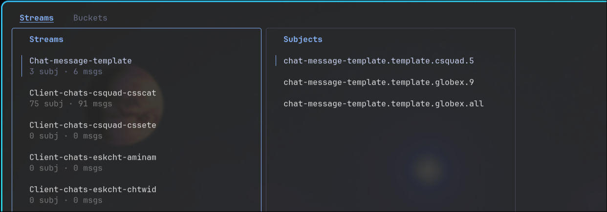

<a id="top-en"></a>
# lazynats

**English** | [Русский](#top-ru)


A TUI for NATS in the style of lazygit / lazydocker, built with
[Bubble Tea](https://github.com/charmbracelet/bubbletea) (Elm architecture).
Two tabs — **Streams** and **Buckets (KV)** — with a list on the left
(~1/3 of the screen) and content on the right.



> *Laziness is the engine of progress.*
> — unofficial motto of every automation script ever written

## Origins

Before lazynats existed, looking at a NATS JetStream deployment from a
terminal meant a sequence of separate `nats` CLI invocations — `nats stream
ls`, `nats stream info <name>`, `nats kv ls`, `nats kv get <bucket> <key>`
— each returning a static snapshot that had to be re-typed to see anything
change. That is perfectly workable for a single, planned lookup. It scales
poorly to the kind of session that support and on-call work actually
consist of: browsing a stream's subjects, glancing into several KV buckets
in a row, checking whether a consumer looks stuck, and repeating all of
that in quick succession while someone is waiting on an answer.

lazynats exists to close that gap, borrowing its shape from lazygit and
lazydocker: stay in the terminal, replace command construction with
navigation, and let looking at a stream or a bucket cost a keystroke
rather than a typed command.

**Where it earns its keep:**

- **Local development** against a JetStream deployment — seeing what a
  service is actually publishing or storing without standing up
  monitoring just to check.
- **On-call / incident triage** — a quick look at consumer lag, subject
  traffic, or a specific KV value, without reconstructing the right `nats`
  invocation under time pressure.
- **Onboarding** — someone new to a project's NATS usage can browse what
  is actually deployed instead of reverse-engineering it from application
  code.
- **Demos and walkthroughs** — a live, navigable view of stream/KV state
  reads far better than a wall of CLI output.

## Stack

- Go 1.23+
- **[Bubble Tea](https://github.com/charmbracelet/bubbletea)** — the whole UI is one Elm-style
  model/update/view loop; this is the core design choice the app is built around
- [Lip Gloss](https://github.com/charmbracelet/lipgloss) — styling; all colors live in `internal/ui/theme`
- [Bubbles](https://github.com/charmbracelet/bubbles) — reusable components (list, viewport, etc.)
- [nats.go](https://github.com/nats-io/nats.go) `v1.45.0` + `jetstream` package (context-aware API) — streams & KV
- [Viper](https://github.com/spf13/viper) — config file + auto-env `LAZYNATS_*`
- [atotto/clipboard](https://github.com/atotto/clipboard) — copy panel content to system clipboard

## Structure

```
main.go                      entrypoint: flags, calls app.Run
internal/config              Config{NatsURL, ThemePath} via viper, Load/Save
internal/natsclient          everything that knows about nats.go: Connect, streams, KV, messages
internal/app                 wiring + bubbletea.Program
internal/ui/theme            Palette + Theme (lipgloss styles), external YAML theme loader
internal/ui/keys             global and list keymaps
internal/ui/contentview      content panel: subject messages / key value + copy to clipboard
internal/ui/streamsview      Streams tab: stream list + subjects (+ message viewer on Enter)
internal/ui/bucketsview      Buckets tab: bucket list + keys (+ value viewer on Enter)
internal/ui/statusbar        bottom bar: connection status + contextual key hints
internal/ui/modal            modal dialogs / confirmations [TODO: уточнить назначение]
internal/ui/root             root model: tabs, layout, routing, key-guard against filter input
```

## Run

```bash
go run . --config ./config.example.yaml
```

Without `--config` the app looks for `~/.config/lazynats/config.yaml`.
If the file is missing it falls back to `nats://127.0.0.1:4222`.

Any config value can be overridden with an environment variable prefixed
with `LAZYNATS_` (viper `AutomaticEnv`):

```bash
LAZYNATS_NATS_URL=nats://prod.example.com:4222 go run .
```

## Building / releases

No prebuilt binaries are kept in the repo. Builds are published via
[GitHub Releases](../../releases) — tag a version (`vX.Y.Z`) and CI
builds cross-platform binaries automatically (e.g. with
[GoReleaser](https://goreleaser.com/)).

Local build:

```bash
go build -o lazynats .
```

## Key bindings

List (Streams / Buckets):
- `tab` — switch tab
- `h` / `l` (or `←` / `→`) — left panel / open right panel
- `j` / `k` (or `↑` / `↓`) — navigate list
- `/` — filter list (built-in from bubbles/list; while filtering global
  hotkeys are disabled)
- `enter` — open content view (same as `l` on the right panel)
- `r` — refresh current tab
- `q` / `ctrl+c` — quit

Content view (after `enter` / `l` on a subject or key):
- `esc` / `h` / `←` — back to list
- `j` / `k`, `pgup` / `pgdn` — scroll (bubbles/viewport)
- `y` — copy all panel content to system clipboard
- `q` — quit

## Theme / customization

All colors are in `internal/ui/theme/theme.go` (`Palette`). To let a
designer tweak colors without touching Go code, drop a file like
`theme.example.yaml` and set the path in config:

```yaml
nats_url: "nats://127.0.0.1:4222"
theme_path: "~/.config/lazynats/theme.yaml"
```

## Common pitfalls

- **Filter mode swallows every keystroke.** While `/` filtering is active,
  `q`, `tab`, and the other global hotkeys are intentionally disabled
  (see "key-guard against filter input" in `internal/ui/root`). If the
  app seems to have "stopped responding to keys," press `esc` first.
- **Silently ignored env vars.** `LAZYNATS_*` variables map onto the
  `Config` struct field names as Viper sees them (`LAZYNATS_NATS_URL`,
  `LAZYNATS_THEME_PATH`). A misspelled or mismatched variable name is not
  rejected — it's just ignored, and the app falls back to the file/default
  value with no warning.
- **`y` fails quietly without a clipboard utility.** `atotto/clipboard`
  shells out to a system clipboard tool. On Linux this means `xclip`,
  `xsel`, or a Wayland equivalent has to be installed; on a headless box
  without one, copying does nothing and gives no error in the UI.
- **No config and nothing listening looks like a hang, not an error.**
  With no `--config` and no `~/.config/lazynats/config.yaml`, lazynats
  defaults to `nats://127.0.0.1:4222`. If nothing is running there, the
  UI can sit waiting rather than failing fast — check the connection
  status in the status bar first.

## See also

- [lazygit](https://github.com/jesseduffield/lazygit) and
  [lazydocker](https://github.com/jesseduffield/lazydocker) — the two TUIs
  lazynats borrows its interaction model from
- [Bubble Tea](https://github.com/charmbracelet/bubbletea) /
  [Bubbles](https://github.com/charmbracelet/bubbles) /
  [Lip Gloss](https://github.com/charmbracelet/lipgloss) — the framework
  the UI is built on
- [NATS JetStream docs](https://docs.nats.io/nats-concepts/jetstream) —
  background on streams, consumers, and KV buckets for anyone new to NATS

## Acknowledgments

Thanks to [Dmitry Malinin](http://github.com/pdacity)
([@dmitry_malinin](https://t.me/dmitry_malinin) on Telegram) for the
review and suggestions that shaped this README, including the idea of a
bilingual write-up.

---

<a id="top-ru"></a>
# lazynats (на русском)

[English](#top-en) | **Русский**

TUI-клиент для NATS в духе lazygit / lazydocker, построенный на
[Bubble Tea](https://github.com/charmbracelet/bubbletea) (архитектура Elm).
Две вкладки — **Streams** и **Buckets (KV)** — список слева (~1/3 экрана)
и содержимое справа.


> *Лень — двигатель прогресса.*
> — неофициальный девиз каждого написанного скрипта автоматизации

## Предыстория

До появления lazynats работа с развёрнутым NATS JetStream из терминала
сводилась к последовательности отдельных вызовов CLI `nats` — `nats
stream ls`, `nats stream info <name>`, `nats kv ls`, `nats kv get
<bucket> <key>` — каждый из которых возвращал статичный снимок,
который приходилось запрашивать заново, чтобы увидеть, что изменилось.
Для единичного, заранее спланированного запроса это вполне рабочий
вариант. Но он плохо масштабируется на тот тип сессий, из которых
на самом деле состоит саппорт и дежурство: просмотр subject-ов стрима,
беглый взгляд в несколько KV-бакетов подряд, проверка, не застрял ли
консьюмер, — и всё это быстро, одно за другим, пока кто-то ждёт ответа.

lazynats написан именно для того, чтобы закрыть этот разрыв, заимствуя
форму у lazygit и lazydocker: оставаться в терминале, заменить
составление команд навигацией и сделать так, чтобы просмотр стрима или
бакета стоил одного нажатия клавиши, а не набранной команды.

**Где это полезно:**

- **Локальная разработка** против развёрнутого JetStream — посмотреть,
  что сервис реально публикует или хранит, не разворачивая ради этого
  мониторинг.
- **Дежурство / разбор инцидентов** — быстро глянуть на отставание
  консьюмера, трафик по subject-ам или конкретное значение в KV, не
  вспоминая под давлением времени точный синтаксис `nats`.
- **Онбординг** — человек, впервые сталкивающийся с NATS в проекте,
  может изучить, что реально развёрнуто, вместо того чтобы
  реконструировать это по коду приложения.
- **Демонстрации** — живой, навигируемый вид состояния стримов и KV
  читается куда лучше, чем стена вывода CLI.

## Стек

- Go 1.23+
- **[Bubble Tea](https://github.com/charmbracelet/bubbletea)** — весь UI построен на одном
  цикле model/update/view в стиле Elm; это ключевое архитектурное решение приложения
- [Lip Gloss](https://github.com/charmbracelet/lipgloss) — стилизация; все цвета живут в `internal/ui/theme`
- [Bubbles](https://github.com/charmbracelet/bubbles) — переиспользуемые компоненты (list, viewport и т.д.)
- [nats.go](https://github.com/nats-io/nats.go) `v1.45.0` + пакет `jetstream` (context-aware API) — стримы и KV
- [Viper](https://github.com/spf13/viper) — конфиг-файл + автоматическое чтение env `LAZYNATS_*`
- [atotto/clipboard](https://github.com/atotto/clipboard) — копирование содержимого панели в системный буфер обмена

## Структура

```
main.go                      точка входа: флаги, вызов app.Run
internal/config              Config{NatsURL, ThemePath} через viper, Load/Save
internal/natsclient          всё, что знает про nats.go: Connect, стримы, KV, сообщения
internal/app                 связывание компонентов + bubbletea.Program
internal/ui/theme            Palette + Theme (стили lipgloss), загрузчик внешней YAML-темы
internal/ui/keys             глобальные и списочные keymap-ы
internal/ui/contentview      панель содержимого: сообщения subject-а / значение ключа + копирование в буфер
internal/ui/streamsview      вкладка Streams: список стримов + subject-ы (+ просмотр сообщения по Enter)
internal/ui/bucketsview      вкладка Buckets: список бакетов + ключи (+ просмотр значения по Enter)
internal/ui/statusbar        нижняя панель: статус соединения + контекстные подсказки по клавишам
internal/ui/modal            модальные диалоги / подтверждения [TODO: уточнить назначение]
internal/ui/root             корневая модель: вкладки, разметка, роутинг, блокировка хоткеев при вводе фильтра
```

## Запуск

```bash
go run . --config ./config.example.yaml
```

Без `--config` приложение ищет `~/.config/lazynats/config.yaml`.
Если файл не найден, используется значение по умолчанию —
`nats://127.0.0.1:4222`.

Любое значение конфига можно переопределить переменной окружения с
префиксом `LAZYNATS_` (viper `AutomaticEnv`):

```bash
LAZYNATS_NATS_URL=nats://prod.example.com:4222 go run .
```

## Сборка / релизы

Готовые бинарники в репозитории не хранятся. Сборки публикуются через
[GitHub Releases](../../releases) — при создании тега (`vX.Y.Z`) CI
автоматически собирает кросс-платформенные бинарники (например, с
помощью [GoReleaser](https://goreleaser.com/)).

Локальная сборка:

```bash
go build -o lazynats .
```

## Горячие клавиши

Список (Streams / Buckets):
- `tab` — переключение вкладки
- `h` / `l` (или `←` / `→`) — левая панель / открыть правую панель
- `j` / `k` (или `↑` / `↓`) — навигация по списку
- `/` — фильтр списка (встроен в bubbles/list; пока идёт фильтрация,
  глобальные хоткеи отключены)
- `enter` — открыть панель содержимого (то же, что `l` на правой панели)
- `r` — обновить текущую вкладку
- `q` / `ctrl+c` — выход

Панель содержимого (после `enter` / `l` на subject-е или ключе):
- `esc` / `h` / `←` — назад к списку
- `j` / `k`, `pgup` / `pgdn` — прокрутка (bubbles/viewport)
- `y` — скопировать всё содержимое панели в системный буфер обмена
- `q` — выход

## Тема / кастомизация

Все цвета — в `internal/ui/theme/theme.go` (`Palette`). Чтобы дизайнер
мог менять цвета, не трогая Go-код, положите файл вроде
`theme.example.yaml` и укажите путь к нему в конфиге:

```yaml
nats_url: "nats://127.0.0.1:4222"
theme_path: "~/.config/lazynats/theme.yaml"
```

## Частые ошибки

- **Режим фильтра "съедает" все клавиши.** Пока активен фильтр `/`,
  `q`, `tab` и прочие глобальные хоткеи намеренно отключены (см.
  «блокировка хоткеев при вводе фильтра» в `internal/ui/root`). Если
  кажется, что приложение «перестало реагировать на клавиши», сначала
  нажмите `esc`.
- **Переменные окружения молча игнорируются.** Переменные `LAZYNATS_*`
  сопоставляются с полями структуры `Config` так, как их видит Viper
  (`LAZYNATS_NATS_URL`, `LAZYNATS_THEME_PATH`). Опечатка или
  несовпадающее имя переменной не вызовет ошибку — она просто будет
  проигнорирована, а приложение молча откатится к значению из файла
  или к дефолту.
- **`y` молча не срабатывает без утилиты буфера обмена.** `atotto/clipboard`
  вызывает системную утилиту буфера обмена. В Linux для этого нужен
  `xclip`, `xsel` или Wayland-аналог; на headless-машине без них
  копирование просто ничего не делает, без какой-либо ошибки в UI.
- **Отсутствие конфига и NATS, до которого не достучаться, выглядит как
  зависание, а не как ошибка.** Без `--config` и без
  `~/.config/lazynats/config.yaml` lazynats по умолчанию идёт на
  `nats://127.0.0.1:4222`. Если там ничего не слушает, UI может просто
  «висеть» вместо явного отказа — сначала проверьте статус соединения
  в нижней панели.

## Смотри также

- [lazygit](https://github.com/jesseduffield/lazygit) и
  [lazydocker](https://github.com/jesseduffield/lazydocker) — два TUI,
  у которых lazynats заимствует модель взаимодействия
- [Bubble Tea](https://github.com/charmbracelet/bubbletea) /
  [Bubbles](https://github.com/charmbracelet/bubbles) /
  [Lip Gloss](https://github.com/charmbracelet/lipgloss) — фреймворк,
  на котором построен UI
- [Документация NATS JetStream](https://docs.nats.io/nats-concepts/jetstream) —
  бэкграунд по стримам, консьюмерам и KV-бакетам для тех, кто впервые
  сталкивается с NATS

## Благодарности

Спасибо [Дмитрию Малинину](http://github.com/pdacity)
([@dmitry_malinin](https://t.me/dmitry_malinin) в Telegram) за ревью и
советы, которые определили содержание этого README, включая идею
двуязычной версии.
